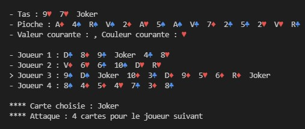
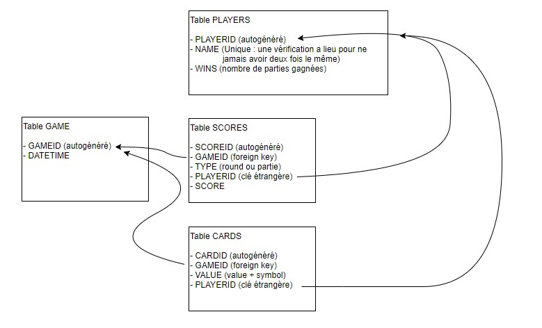

## Intro

A project made with a friend in 2021 for a school assignment. This is a UNO-like card game written in C++11, playable in the console, and there is also a SQLite database to store various information (games, players and scores, cards played).

Compilator used is MinGW/g++ which has to be installed first, then run `AutoLunch.bat` to launch the main game.

Database used is a portable SQLite `parties.db` file, that you can run with `AutoSQL.bat` (you need the sqlite3.o and .h files from the corresponding library).
- - -

### Features
- Playable against the computer or not
- Argument given at launch = amount of human players (card choice = their input, instead of the algorithm)
- Some cards have special rules such as making another player draw cards or change the current symbol
- Once one hand is empty = end of round -> scores are calculated -> play again
- Once one player reaches 500pts or more -> end of the game
- Everything is stored in `parties.db` with SQLite

- - -

